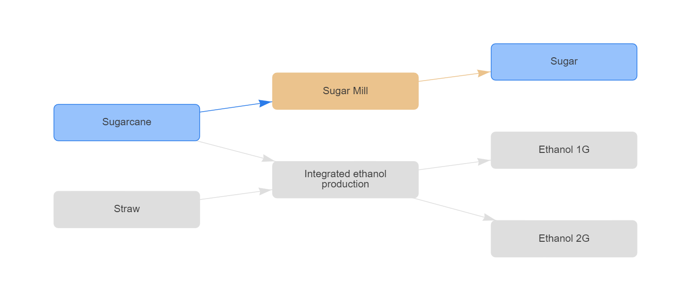

# Getting started with OptBio

This tutorial is aimed at providing a quick introduction to defining bioproducts chains and optimizing its investments and operations using OptBio.

# What is OptBio?

OptBio is a open-source optimization library for bioproducts chains. It is built on top of [JuMP](https://jump.dev/JuMP.jl/stable/). It allows users to define a bioproducts chain, including products, processes and plants, and optimize the investments and operations of the chain.

# Installation

OptBio is a package for Julia. To install it, you need to have Julia installed on your computer. To install Julia, please visit the [Julia website](https://julialang.org/downloads/#current_stable_release). After installing Julia, you can install OptBio by running the following command in the Julia REPL:

```julia
import Pkg
Pkg.add("OptBio")
```

# An example

In this example, we will define a simple bioproducts chain based on sugarcane and its straw. The chain will include a sugar mill and an ethanol plant. The sugar mill will produce sugar from sugarcane, and the ethanol plant will produce first and second generation ethanol from sugarcane and straw. Attributes of each of these elements will be defined, and also the relationships between them.

```julia
using OptBio

filename = "my_optbio_case_folder/my_chain.optbio"
database = OptBio.create_case(filename)

OptBio.add_product!(
    database;
    label = "Sugar",
    sell_price = 5000.0,
    unit = "t",
)

OptBio.add_product!(
    database;
    label = "Sugarcane",
    unit = "t",
    initial_availability = 100.0,
)

OptBio.add_plant!(
    database;
    label = "Sugar Mill",
    reference_capacity = 100.0,
    reference_capex = 52000.0,
)

OptBio.add_process!(
    database;
    label = "Sugar Mill",
    opex = 0.0,
    product_input = ["Sugarcane"],
    factor_input = [1.0],
    product_output = ["Sugar"],
    factor_output = [0.75],
)

OptBio.set_process_plant!(database, "Sugar Mill", "Sugar Mill")

OptBio.add_product!(
    database;
    label = "Straw",
    unit = "t",
    initial_availability = 100.0,
)

OptBio.add_product!(
    database;
    label = "Ethanol 1G",
    unit = "kL",
    sell_price = 0.5,
)

OptBio.add_product!(
    database;
    label = "Ethanol 2G",
    unit = "kL",
    sell_price = 0.7,
)

OptBio.add_plant!(
    database;
    label = "Ethanol Plant",
    reference_capacity = 100.0,
    reference_capex = 100000.0,
)

OptBio.add_process!(
    database;
    label = "Integrated ethanol production",
    opex = 0.0,
    product_input = ["Sugarcane", "Straw"],
    factor_input = [1.0, 0.9],
    product_output = ["Ethanol 1G", "Ethanol 2G"],
    factor_output = [7.5, 6.0],
)

OptBio.set_process_plant!(database, "Integrated ethanol production", "Ethanol Plant")

OptBio.close_database!(database)
```

After running this code, a file named `my_chain.optbio` will be created in the folder `my_optbio_case_folder`. This file will be used by OptBio to extract the information about the bioproducts chain, build the optimization problem and solve it.

```julia
julia> inputs, solution = OptBio.main([filename]);

julia> @show solution["capacity"];
solution["capacity"] = [100.0, 0.0]

julia> @show solution["investment"];
solution["investment"] = [52000.0, 0.0]

julia> @show solution["sell"];
solution["sell"] = [75.0; 0.0; 0.0; 0.0; 0.0;;]
```
After running the OptBio optimization, a summary of the main results will be available in the `solution` dictionary. A more detailed report will be available in the folder `my_optbio_case_folder/results`, including many `.csv` files with the results of the optimization, the file `optbio_dashboard.html` with a dashboard of the results, and the file `optbio_flowchart.html` with a flowchart of the bioproducts chain, with the paths of chosen investments highlighted, as shown in the image below.



# Step-by-step
Once the OptBio package is installed, to use it in your programs write:
    
```julia
using OptBio
```

To initialize a new OptBio case, use the `create_case` function, passing the name of the file where the case will be saved. This function will return a database object that will be used to define the bioproducts chain.

```julia
filename = "my_optbio_case_folder/my_chain.optbio"
database = OptBio.create_case(filename)
```

Products are defined using the `add_product!` function. The function receives the database object and some attributes of the product. `label`and `unit` are mandatory attributes. The `sell_price` attribute is optional and represents the price at which the product is sold. In the code below, we add to the database the product "Sugar", which is sold at a price of \$5000.0 per ton.

```julia	
OptBio.add_product!(
    database;
    label = "Sugar",
    sell_price = 5000.0,
    unit = "t",
)
```

Another attribute that can be defined for a product is the `initial_availability`, which represents the initial availability of the product in the chain. It is necessary that the root product of the chain has its initial availability defined. In the code below, we add to the database the product "Sugarcane", which has an initial availability of 100.0 tons. Also, it has no `sell_price` attribute, which means that it is not sold.

```julia
OptBio.add_product!(
    database;
    label = "Sugarcane",
    unit = "t",
    initial_availability = 100.0,
)
```

Plants are defined using the `add_plant!` function. The function receives the database object and some attributes of the plant. `label`, `reference_capacity` and `reference_capex` are mandatory attributes. In the code below, we add to the database the plant "Sugar Mill", which has a reference capacity of 100.0 tons (unit is based on the first product that will linked to it) and a reference capital expenditure of \$52000.0.

```julia
OptBio.add_plant!(
    database;
    label = "Sugar Mill",
    reference_capacity = 100.0,
    reference_capex = 52000.0,
)
```

Processes are defined using the `add_process!` function. As usual, `label` is a mandatory attribute. Also, the `opex` attribute must be defined, representing the operational expenditure of the process. The process must have a vector of input products, defined by the `product_input` attribute, and a vector of output products, defined by the `product_output` attribute. The `factor_input` and `factor_output` attributes represent the proportion of each input and output product in the process. In the code below, we add to the database the process "Sugar Mill", which has no operational expenditure, and produces 0.75 tons of sugar for each ton of sugarcane processed.

```julia
OptBio.add_process!(
    database;
    label = "Sugar Mill",
    opex = 0.0,
    product_input = ["Sugarcane"],
    factor_input = [1.0],
    product_output = ["Sugar"],
    factor_output = [0.75],
)
```

The `set_process_plant!` function is used to link a process to a plant. The function receives the database object, the label of the process and the label of the plant. In the code below, we link the process "Sugar Mill" to the plant "Sugar Mill". 

```julia
OptBio.set_process_plant!(database, "Sugar Mill", "Sugar Mill")
```

Now, let's define the remaining elements of the bioproducts chain. We will add the products "Straw", "Ethanol 1G", and "Ethanol 2G" to the database. We will also add the plant "Ethanol Plant" and the process "Integrated ethanol production" that converts sugarcane and straw into first and second generation ethanol. Finally, we will link the process to the plant. Here is the code:

```julia
OptBio.add_product!(
    database;
    label = "Straw",
    unit = "t",
    initial_availability = 100.0,
)

OptBio.add_product!(
    database;
    label = "Ethanol 1G",
    unit = "kL",
    sell_price = 0.5,
)

OptBio.add_product!(
    database;
    label = "Ethanol 2G",
    unit = "kL",
    sell_price = 0.7,
)

OptBio.add_plant!(
    database;
    label = "Ethanol Plant",
    reference_capacity = 100.0,
    reference_capex = 100000.0,
)

OptBio.add_process!(
    database;
    label = "Integrated ethanol production",
    opex = 0.0,
    product_input = ["Sugarcane", "Straw"],
    factor_input = [1.0, 0.9],
    product_output = ["Ethanol 1G", "Ethanol 2G"],
    factor_output = [7.5, 6.0],
)

OptBio.set_process_plant!(database, "Integrated ethanol production", "Ethanol Plant")
```

After defining the bioproducts chain, close the database using the `close_database!` function. This function receives the database object as an argument. In the code below, we close the database.

```julia
OptBio.close_database!(database)
```

Now the bioproducts chain is defined and saved in the file `my_chain.optbio`. To optimize the investments and operations of the chain, use the `main` function. This function receives a vector with the arguments of the execution, including the path of the `.optbio` file. The function returns a tuple with two elements: the first element is a dictionary with the inputs of the optimization, and the second element is a dictionary with the results of the optimization. In the code below, we optimize the chain defined in the file `my_chain.optbio`.

```julia
inputs, solution = OptBio.main([filename])
```

